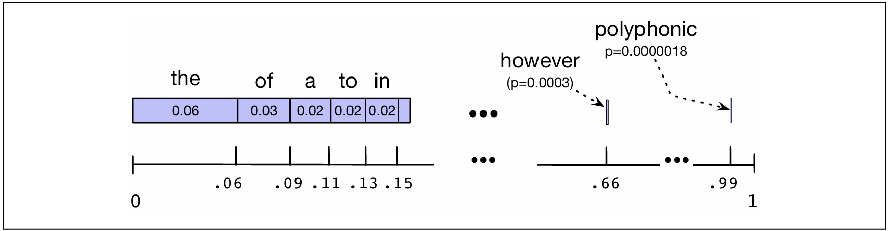
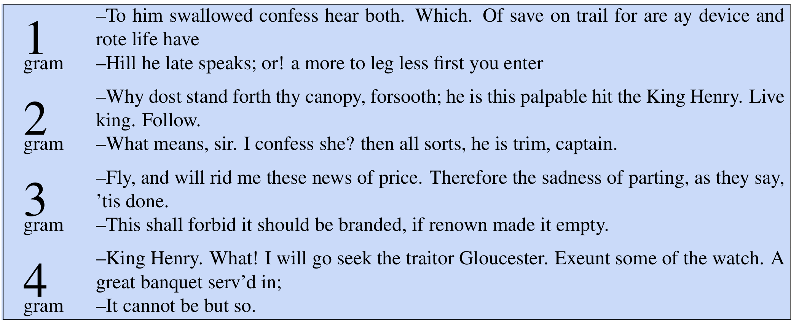
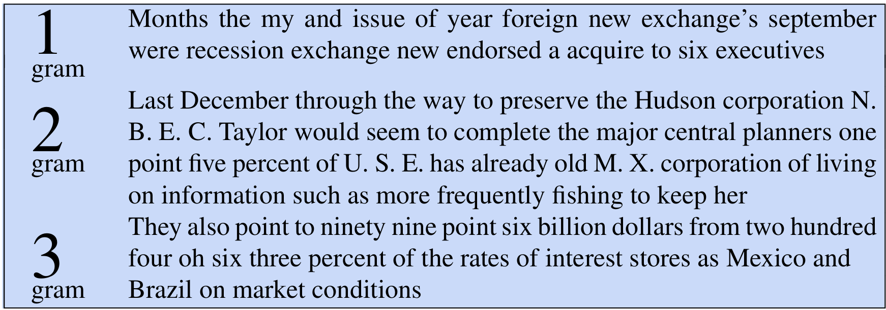

# 3.4 Sampling sentences from a language model

Một cách quan trọng để hình dung loại kiến thức mà một mô hình ngôn ngữ ẩn chứa chính là lấy mẫu (sampling) từ nó.

Việc lấy mẫu từ một phân phối có nghĩa là chọn các điểm dữ liệu ngẫu nhiên dựa trên khả năng xuất hiện (xác suất) của chúng. Do đó, lấy mẫu từ một mô hình ngôn ngữ — vốn đại diện cho một phân phối trên các câu — đồng nghĩa với việc tạo ra một số câu, trong đó mỗi câu được chọn theo xác suất mà mô hình đã xác định.

Vì vậy, chúng ta có nhiều khả năng tạo ra những câu mà mô hình cho là có xác suất cao, và ít có khả năng tạo ra những câu mà mô hình cho là có xác suất thấp.

>* Hình 1: Một hình ảnh minh họa về phân phối lấy mẫu để tạo ra các câu bằng cách lấy mẫu unigram lặp đi lặp lại. Thanh màu xanh đại diện cho tần suất tương đối của mỗi từ (chúng tôi đã sắp xếp chúng theo thứ tự từ xuất hiện nhiều nhất đến ít nhất, nhưng việc lựa chọn thứ tự này là tùy ý). 
Trục số hiển thị xác suất tích lũy. Nếu chúng ta chọn một con số ngẫu nhiên trong khoảng từ 0 đến 1, nó sẽ rơi vào một khoảng tương ứng với một từ nào đó. Kỳ vọng (xác suất) để con số ngẫu nhiên rơi vào các khoảng lớn hơn của một trong những từ phổ biến (như the, of, a) cao hơn nhiều so với việc rơi vào khoảng nhỏ của một trong những từ hiếm (như polyphonic). 

Kỹ thuật hình dung một mô hình ngôn ngữ thông qua việc lấy mẫu này đã được đề xuất từ rất sớm bởi Shannon (1948) cùng Miller và Selfridge (1950).Cách dễ nhất là hình dung cơ chế này hoạt động như thế nào đối với trường hợp unigram (mô hình đơn từ). Hãy tưởng tượng toàn bộ các từ trong tiếng Anh phủ kín một trục số từ 0 đến 1, trong đó mỗi từ chiếm một khoảng không gian tỉ lệ thuận với tần suất xuất hiện của nó. Hình 1 minh họa cho việc này bằng cách sử dụng một mô hình unigram được tính toán từ chính văn bản của cuốn sách này. Chúng ta chọn một giá trị ngẫu nhiên trong khoảng từ 0 đến 1, tìm điểm đó trên trục xác suất và in ra từ mà khoảng của nó bao hàm giá trị đã chọn. Chúng ta tiếp tục chọn các số ngẫu nhiên và tạo ra các từ cho đến khi ngẫu nhiên tạo ra được mã thông báo kết thúc câu (sentence-final token).Chúng ta có thể sử dụng cùng kỹ thuật này để tạo ra các bigram (mô hình cặp từ). Đầu tiên, ta tạo ra một bigram ngẫu nhiên bắt đầu bằng ký hiệu bắt đầu câu `<s>` (dựa trên xác suất bigram của nó). Giả sử từ thứ hai của bigram đó là $w$. Tiếp theo, chúng ta chọn một bigram ngẫu nhiên bắt đầu bằng $w$ (một lần nữa, được rút ra dựa trên xác suất bigram của nó), và cứ tiếp tục như vậy.

# 3.5 Generalizing vs. overfitting the training set

Mô hình n-gram, giống như nhiều mô hình thống kê khác, phụ thuộc rất nhiều vào tập dữ liệu huấn luyện (training corpus).

Một hệ quả của việc này là các xác suất thường mã hóa những dữ kiện cụ thể có trong tập dữ liệu đó. Một hệ quả khác là khi ta tăng giá trị của n, các mô hình n-gram sẽ mô phỏng tập dữ liệu huấn luyện ngày càng chính xác hơn.

Chúng ta có thể sử dụng phương pháp lấy mẫu (sampling) từ phần trước để trực quan hóa cả hai sự thật này! Để giúp bạn hình dung về sức mạnh ngày càng tăng của các n-gram bậc cao, Hình 2 hiển thị các câu ngẫu nhiên được tạo ra từ các mô hình unigram, bigram, trigram và 4-gram được huấn luyện dựa trên các tác phẩm của Shakespeare.

Phân tích kết quả:
- Độ mạch lạc: Ngữ cảnh càng dài thì các câu càng trở nên mạch lạc.

- Unigram: Các câu tạo ra không cho thấy mối liên hệ logic nào giữa các từ, cũng như không có dấu kết thúc câu.

- Bigram: Đã có một số sự liên kết cục bộ giữa từ với từ (đặc biệt là khi coi dấu câu như một từ).

- Trigram: Các câu bắt đầu trông rất giống phong cách của Shakespeare.

- 4-gram: Thực tế, các câu 4-gram trông "quá giống" Shakespeare. Cụm từ “It cannot be but so” được trích trực tiếp từ tác phẩm King John.

>* Hình 2: Tám câu văn được tạo ngẫu nhiên từ bốn mô hình n-gram dựa trên các tác phẩm của Shakespeare. Tất cả ký tự được chuyển về chữ thường và dấu câu được xử lý như một từ. Kết quả đã được hiệu chỉnh thủ công về viết hoa để dễ đọc hơn.

Để hiểu rõ hơn về sự phụ thuộc vào tập dữ liệu huấn luyện, hãy cùng xem xét các mô hình ngôn ngữ (LMs) được huấn luyện trên một bộ ngữ liệu hoàn toàn khác: tờ báo Wall Street Journal (WSJ).

Cả Shakespeare và WSJ đều là tiếng Anh, vì vậy chúng ta có thể kỳ vọng sẽ có một số điểm giao thoa giữa các n-gram của hai thể loại này. Hình 3 hiển thị các câu được tạo ra bởi các mô hình unigram, bigram và trigram được huấn luyện trên 40 triệu từ từ WSJ.

>* Hình 3: Ba câu văn được tạo ngẫu nhiên từ ba mô hình n-gram, xây dựng dựa trên 40 triệu từ từ báo Wall Street Journal. Tất cả ký tự được chuyển thành chữ thường và dấu câu được xử lý như một từ. Kết quả sau đó được hiệu chỉnh viết hoa thủ công để dễ đọc hơn.

Hãy so sánh những ví dụ này với các câu "giả Shakespeare" ở Hình 3.4. Mặc dù cả hai đều mô phỏng "các câu có vẻ giống tiếng Anh", nhưng không hề có sự trùng lặp nào trong các câu được tạo ra, và thậm chí rất ít sự giao thoa ở các cụm từ nhỏ. Các mô hình thống kê sẽ trở nên khá vô dụng trong việc dự đoán nếu tập dữ liệu huấn luyện (training set) và tập dữ liệu kiểm tra (test set) khác biệt nhau quá lớn như Shakespeare và báo WSJ.

Làm thế nào để giải quyết vấn đề này khi xây dựng các mô hình n-gram?

Một bước quan trọng là phải đảm bảo sử dụng tập dữ liệu huấn luyện (training corpus) có cùng thể loại với tác vụ mà chúng ta đang thực hiện. Ví dụ:

- Để xây dựng mô hình dịch tài liệu pháp lý, ta cần dữ liệu về văn bản luật.

- Để xây dựng hệ thống trả lời câu hỏi, ta cần tập dữ liệu gồm các câu hỏi.

Việc thu thập dữ liệu huấn luyện đúng phương ngữ (dialect) hoặc biến thể (variety) cũng quan trọng không kém, đặc biệt là khi xử lý các bài đăng trên mạng xã hội hoặc bản ghi chép lời nói.

Ví dụ, một số bài đăng trên Twitter sẽ sử dụng các đặc điểm của Tiếng Anh của người Mỹ gốc Phi (AAE) — tên gọi chung cho nhiều biến thể ngôn ngữ được sử dụng trong các cộng đồng người Mỹ gốc Phi (King, 2020). Những đặc điểm này có thể bao gồm các từ như finna — một trợ động từ dùng để chỉ thì tương lai gần — vốn không xuất hiện trong các biến thể khác, hoặc cách đánh vần như den thay cho then, trong những dòng tweet như thế này (Blodgett và O’Connor, 2017):

(3.22) Bored af den my phone finna die!!!

Trong khi đó, các dòng tweet từ các ngôn ngữ dựa trên tiếng Anh như Tiếng Pidgin Nigeria lại có từ vựng và các mô hình n-gram khác biệt rõ rệt so với tiếng Anh Mỹ (Jurgens và các cộng sự, 2017):

(3.23) @username R u a wizard or wat gan sef: in d mornin- u tweet, afternoon- u tweet, nyt gan u dey tweet. beta get ur IT placement wiv twitter

Liệu có khả năng tập kiểm tra (test set) vẫn xuất hiện một từ mà chúng ta chưa từng thấy trước đây không? Điều gì sẽ xảy ra nếu từ "Jurafsky" không bao giờ xuất hiện trong tập huấn luyện, nhưng lại đột ngột hiện ra trong tập kiểm tra?

Câu trả lời là mặc dù các "từ" có thể chưa được nhìn thấy, nhưng chúng ta thường chạy các thuật toán NLP không phải trên các từ nguyên bản mà trên các đơn vị từ con (subword tokens). Với phương pháp tách từ con (như thuật toán BPE ở Chương 2), bất kỳ từ nào cũng có thể được mô hình hóa dưới dạng một chuỗi các đơn vị con đã biết, và nếu cần thiết, có thể là một chuỗi các token tương ứng với từng chữ cái riêng lẻ.

Vì vậy, mặc dù để thuận tiện, chúng ta vẫn gọi là "từ" trong chương này, nhưng từ vựng của mô hình ngôn ngữ thực chất thường là một tập hợp các token chứ không phải là các từ nguyên vẹn; và bằng cách này, tập kiểm tra sẽ không bao giờ chứa các token chưa từng thấy (unseen tokens).